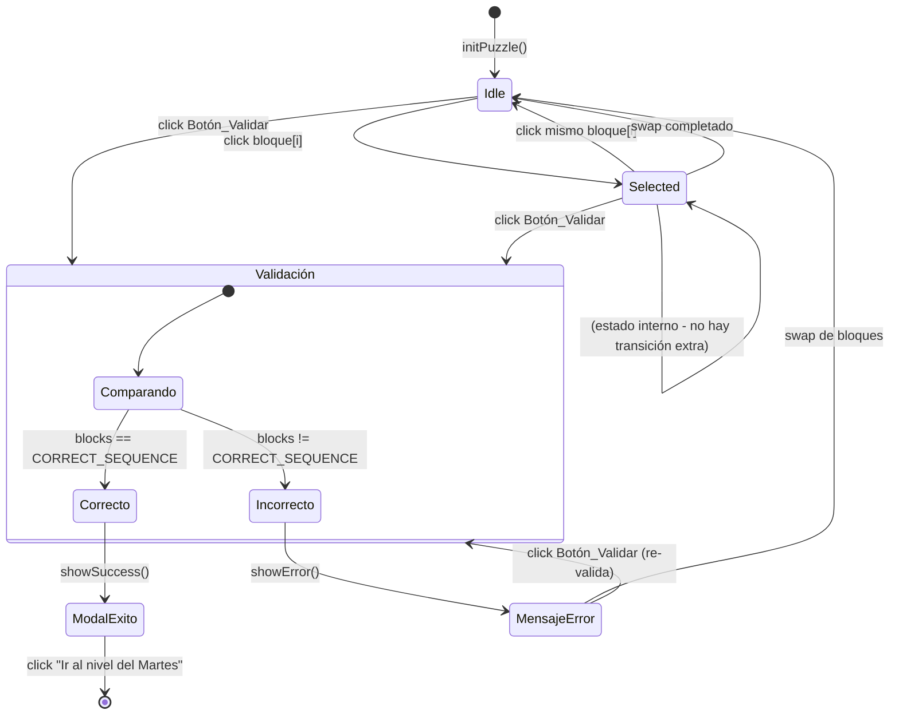

# Design Document — monday-level-screen

## Overview

La lógica JavaScript del puzzle interactivo del nivel "Lunes" se implementa íntegramente en un bloque `<script>` embebido al final del único archivo `index.html`. No hay bundler, no hay módulos ES, no hay dependencias externas: JavaScript vainilla puro.

El objetivo del diseño es separar conceptualmente las responsabilidades (estado, renderizado, interacción, validación, integración con el DOM) dentro de ese único bloque de script, de modo que cada función tenga una responsabilidad clara y el flujo sea trazable y testeable.

### Principios de diseño

- **Estado centralizado**: un único objeto `PuzzleState` es la fuente de verdad. Ninguna función consulta el DOM para inferir estado.
- **Funciones puras donde sea posible**: las funciones de validación y shuffling son puras (dependen solo de sus argumentos, no de efectos laterales).
- **Separación entre lógica y presentación**: las funciones de renderizado leen el estado y escriben en el DOM; las funciones de lógica modifican el estado sin tocar el DOM.
- **Integración mediante IDs estables**: el script se enlaza al DOM exclusivamente a través de IDs definidos en el HTML, no mediante selectores CSS frágiles.

---

## Architecture

El script se organiza en cuatro capas:

```
┌─────────────────────────────────────────────────┐
│                   index.html                    │
│                                                 │
│  ┌──────────────┐    ┌────────────────────────┐ │
│  │  HTML/CSS    │    │   <script> — Puzzle JS │ │
│  │  (Tailwind)  │    │                        │ │
│  └──────────────┘    │  ┌──────────────────┐  │ │
│                      │  │   Estado (State) │  │ │
│                      │  └────────┬─────────┘  │ │
│                      │           │             │ │
│                      │  ┌────────▼─────────┐  │ │
│                      │  │     Lógica       │  │ │
│                      │  │ (shuffle,        │  │ │
│                      │  │  validate,       │  │ │
│                      │  │  swap)           │  │ │
│                      │  └────────┬─────────┘  │ │
│                      │           │             │ │
│                      │  ┌────────▼─────────┐  │ │
│                      │  │   Renderizado    │  │ │
│                      │  │ (renderBlocks,   │  │ │
│                      │  │  showSuccess,    │  │ │
│                      │  │  showError,      │  │ │
│                      │  │  updateCredits)  │  │ │
│                      │  └────────┬─────────┘  │ │
│                      │           │             │ │
│                      │  ┌────────▼─────────┐  │ │
│                      │  │  Event Handlers  │  │ │
│                      │  │ (handleBlockClick│  │ │
│                      │  │  handleValidate) │  │ │
│                      │  └──────────────────┘  │ │
│                      └────────────────────────┘ │
└─────────────────────────────────────────────────┘
```

### Flujo de arranque

```
DOMContentLoaded
    └─► initPuzzle()
            ├─► Define CORRECT_SEQUENCE (array fijo)
            ├─► shuffleBlocks(CORRECT_SEQUENCE) → PuzzleState.blocks
            ├─► renderBlocks()
            └─► attachEventListeners()
```

---

## Components and Interfaces

### Constantes globales

```javascript
const CORRECT_SEQUENCE = [
  { id: 'block-1', label: 'Definición de Requisitos' },
  { id: 'block-2', label: 'Diseño Técnico' },
  { id: 'block-3', label: 'Planificación de Implementación' },
  { id: 'block-4', label: 'Despliegue' }
];

const CREDITS_REWARD = 250;
```

`CORRECT_SEQUENCE` es inmutable. Se congela con `Object.freeze` para evitar mutaciones accidentales.

### Funciones principales

#### `initPuzzle(): void`
Punto de entrada. Invocado desde `DOMContentLoaded`. Inicializa el estado, hace el shuffle, renderiza los bloques y registra event listeners.

#### `shuffleBlocks(blocks: Block[]): Block[]`
**Función pura.** Recibe el array de bloques y retorna una nueva permutación aleatoria usando el algoritmo Fisher-Yates. Garantiza que el resultado sea una permutación válida del input. No muta el array original.

```
Input:  [A, B, C, D]
Output: [C, A, D, B]  (ejemplo — orden aleatorio)
```

#### `renderBlocks(): void`
Lee `PuzzleState.blocks` y construye el HTML de los bloques dentro del contenedor `#assembly-area`. Aplica la clase CSS de selección activa si `PuzzleState.selectedIndex !== null`. Limpia el contenedor antes de re-renderizar.

#### `handleBlockClick(index: number): void`
Gestiona el click en un bloque. Implementa la máquina de estados de selección/swap:
- Si `selectedIndex === null` → selecciona el bloque en `index`.
- Si `selectedIndex === index` → deselecciona (toggle).
- Si `selectedIndex !== index` → llama a `swapBlocks(selectedIndex, index)`, luego deselecciona y oculta el `Mensaje_Error` si está visible.

#### `swapBlocks(i: number, j: number): void`
Intercambia las posiciones `i` y `j` dentro de `PuzzleState.blocks`. Muta el array de estado y llama a `renderBlocks()`.

#### `validateSolution(): boolean`
**Función pura** (respecto al estado del puzzle). Compara `PuzzleState.blocks` con `CORRECT_SEQUENCE` elemento a elemento por `id`. Retorna `true` si la secuencia coincide, `false` en caso contrario.

#### `handleValidate(): void`
Event handler del botón "Validar Solución". Llama a `validateSolution()`. Si `true` → llama a `showSuccess()`. Si `false` → llama a `showError()`.

#### `showSuccess(): void`
Incrementa `window.gameCredits` en `CREDITS_REWARD`, actualiza `#credits-display`, y muestra el `#modal-exito` con el botón "Ir al nivel del Martes".

#### `showError(): void`
Muestra el `#error-message` con el texto `ERROR:: Error de especificación: secuencia lógica alterada`.

#### `hideError(): void`
Oculta el `#error-message`. Llamado por `handleBlockClick` cuando ocurre un swap.

---

## Data Models

### `Block`

```javascript
/**
 * @typedef {Object} Block
 * @property {string} id     - Identificador único del bloque (e.g., 'block-1')
 * @property {string} label  - Texto descriptivo de la etapa que representa
 */
```

### `PuzzleState`

```javascript
const PuzzleState = {
  blocks: [],          // Block[] — orden actual de los bloques (mutable)
  selectedIndex: null  // number | null — índice del bloque seleccionado actualmente
};
```

### Relación entre modelos y DOM

| Campo de estado       | Reflejo en DOM                                      |
|----------------------|-----------------------------------------------------|
| `blocks[i].label`    | Texto del elemento `.block-item` en posición `i`    |
| `selectedIndex`      | Clase `.block-selected` en el elemento correspondiente |
| `window.gameCredits` | Texto de `#credits-display`                         |
| Error visible        | Visibilidad de `#error-message`                     |
| Modal visible        | Visibilidad de `#modal-exito`                       |

### IDs del DOM esperados en `index.html`

| ID                  | Descripción                                              |
|---------------------|----------------------------------------------------------|
| `#assembly-area`    | Contenedor donde se renderizan los bloques del puzzle    |
| `#validate-btn`     | Botón "Validar Solución"                                 |
| `#error-message`    | Contenedor inline del mensaje de error                   |
| `#modal-exito`      | Modal superpuesto que se muestra en caso de éxito        |
| `#credits-display`  | Elemento que muestra el valor actual de créditos         |
| `#next-level-btn`   | Botón "Ir al nivel del Martes" dentro del modal          |

### API global `window.gameCredits`

El script espera que `window.gameCredits` ya esté definido en el HTML como entero no negativo. El script solo lo incrementa; nunca lo inicializa ni lo reinicia.

---

## State Machine — Interaction Flow

El puzzle implementa una máquina de estados con tres estados posibles para la selección:

```
┌─────────────────────────────────────────────────────────────┐
│                     IDLE                                    │
│              (ningún bloque seleccionado)                   │
└────────────────────────┬────────────────────────────────────┘
                         │ clic en bloque[i]
                         ▼
┌─────────────────────────────────────────────────────────────┐
│                  SELECTED(i)                                │
│          (bloque[i] marcado como seleccionado)              │
└──────┬──────────────────────────┬───────────────────────────┘
       │ clic en bloque[i]        │ clic en bloque[j] (j ≠ i)
       │ (mismo bloque)           │
       ▼                          ▼
┌─────────────┐         ┌──────────────────────────────────────┐
│    IDLE     │         │  SWAP: intercambia blocks[i] ↔ [j]  │
│(deselect)   │         │  → renderBlocks()                    │
└─────────────┘         │  → hideError() si error visible       │
                        │  → vuelve a IDLE                     │
                        └──────────────────────────────────────┘

Desde cualquier estado:
  clic en "Validar Solución"
    ├─► validateSolution() === true  → showSuccess()
    └─► validateSolution() === false → showError()
```

### Diagrama de flujo completo (Mermaid)



---

## Correctness Properties

*Una propiedad es una característica o comportamiento que debe ser verdadero en todas las ejecuciones válidas del sistema — esencialmente, una afirmación formal sobre lo que el sistema debe hacer. Las propiedades sirven como puente entre las especificaciones legibles por humanos y las garantías de corrección verificables por máquinas.*

---

### Property 1: La visualización de fecha coincide con la fecha del dispositivo

*Para cualquier* objeto `Date` dado como entrada a las funciones de renderizado de la `Barra_Progreso`, el nombre del día de la semana mostrado debe coincidir con el día de la semana de esa fecha, y la cadena de fecha mostrada debe tener el formato `DD/M` correspondiente a ese mismo objeto `Date`.

**Validates: Requirements 2.2, 2.3**

---

### Property 2: Los estilos de los días de la semana reflejan el estado del día activo

*Para cualquier* índice de día activo `d` (0 = Lunes, 6 = Domingo), al renderizar la `Barra_Progreso`:
- El elemento del día `d` debe tener la clase CSS de resaltado activo.
- Los elementos de los días con índice `< d` (días anteriores) deben tener el estilo de días completados.
- Los elementos de los días con índice `> d` (días futuros) deben tener el estilo de opacidad reducida.
- Ningún día distinto de `d` debe tener la clase de resaltado activo.

**Validates: Requirements 2.4, 2.5**

---

### Property 3: El crédito mostrado refleja exactamente el valor asignado

*Para cualquier* entero no negativo `c`, cuando `window.gameCredits` se establece en `c` y se llama a `updateCreditsDisplay()`, el texto visible de `#credits-display` debe representar exactamente el valor `c`.

**Validates: Requirements 4.6**

---

### Property 4: El shuffle produce siempre una permutación válida

*Para cualquier* invocación de `shuffleBlocks(CORRECT_SEQUENCE)`, el array resultante debe:
1. Tener exactamente la misma longitud que el array de entrada.
2. Contener exactamente los mismos elementos (mismos `id`s) que el array de entrada.
3. No contener elementos duplicados.

**Validates: Requirements 7.2**

---

### Property 5: El click en un bloque implementa la selección y deselección correctamente

*Para cualquier* índice de bloque `i` válido (0–3):
- Si `PuzzleState.selectedIndex === null`, después de llamar a `handleBlockClick(i)`, se cumple que `PuzzleState.selectedIndex === i`.
- Si `PuzzleState.selectedIndex === i`, después de llamar a `handleBlockClick(i)`, se cumple que `PuzzleState.selectedIndex === null` y `PuzzleState.blocks` no ha cambiado.

**Validates: Requirements 8.1, 8.3**

---

### Property 6: El swap intercambia exactamente las posiciones indicadas y deselecciona

*Para cualquier* par de índices distintos `i` y `j` (0–3), cuando `PuzzleState.selectedIndex === i` y se llama a `handleBlockClick(j)`:
- `PuzzleState.blocks[i]` (post-swap) debe ser igual al `PuzzleState.blocks[j]` (pre-swap).
- `PuzzleState.blocks[j]` (post-swap) debe ser igual al `PuzzleState.blocks[i]` (pre-swap).
- Todos los demás bloques permanecen en sus posiciones.
- `PuzzleState.selectedIndex === null` tras el swap.

**Validates: Requirements 8.2**

---

### Property 7: Los bloques son siempre una permutación válida del conjunto original

*Para cualquier* secuencia de llamadas válidas a `swapBlocks`, `renderBlocks` y `handleBlockClick`, el array `PuzzleState.blocks` debe contener exactamente los cuatro bloques de `CORRECT_SEQUENCE` (sin duplicados, sin ausencias), independientemente del número de operaciones realizadas.

**Validates: Requirements 8.4, 11.2**

---

### Property 8: `validateSolution` es correcta para toda permutación posible

*Para cualquier* permutación `p` de los cuatro bloques:
- `validateSolution()` devuelve `true` si y solo si `p` es idéntica a `CORRECT_SEQUENCE` (comparando por `id` en cada posición).
- `validateSolution()` devuelve `false` para las 23 permutaciones restantes.

**Validates: Requirements 9.3**

---

### Property 9: El éxito incrementa los créditos en exactamente 250

*Para cualquier* valor inicial de `window.gameCredits` igual a `c` (entero no negativo), cuando `validateSolution()` retorna `true` y se llama a `showSuccess()`, el nuevo valor de `window.gameCredits` debe ser exactamente `c + 250`.

**Validates: Requirements 10.2**

---

### Property 10: El error se muestra para toda permutación incorrecta

*Para cualquier* permutación de los bloques que no sea igual a `CORRECT_SEQUENCE`, cuando se llama a `handleValidate()`, el elemento `#error-message` debe ser visible y su contenido debe incluir el prefijo `"ERROR::"`.

**Validates: Requirements 11.1**

---

### Property 11: El mensaje de error se oculta al realizar cualquier swap

*Para cualquier* par de índices válidos `(i, j)` con `i ≠ j`, si el `#error-message` está visible y se ejecuta `handleBlockClick(i)` seguido de `handleBlockClick(j)` (generando un swap), entonces el `#error-message` debe estar oculto al finalizar la operación.

**Validates: Requirements 11.3**

---

## Error Handling

### Casos de error contemplados

| Escenario | Comportamiento esperado |
|-----------|------------------------|
| `window.gameCredits` no está definido al llamar `showSuccess()` | Se inicializa a 0 antes de incrementar; se emite `console.warn` |
| El contenedor `#assembly-area` no existe en el DOM | `initPuzzle()` aborta con `console.error` sin lanzar excepción no capturada |
| El botón `#validate-btn` no existe en el DOM | El event listener no se registra; se emite `console.warn` |
| `shuffleBlocks` recibe un array vacío | Retorna array vacío sin error |
| `swapBlocks` recibe índices fuera de rango | No realiza la operación; se emite `console.error` |
| Tailwind CSS no carga desde CDN | Los estilos inline de fallback (Requirement 1.6) cubren los colores críticos; la lógica JS no se ve afectada |

### Decisión de diseño: sin excepciones al usuario

El puzzle no debe mostrar errores de JavaScript al jugador. Todos los errores son silenciosos hacia el UI y registrados en consola para facilitar el debugging por parte del desarrollador.

---

## Testing Strategy

### Enfoque dual: unit tests + property-based tests

El módulo JavaScript del puzzle expone sus funciones principales a través de un objeto `window.PuzzleModule` cuando se ejecuta en entorno de test (detectable por `window.__TESTING__ === true`). Esto permite importar y testear las funciones puras sin necesidad de un DOM completo.

```javascript
if (window.__TESTING__) {
  window.PuzzleModule = {
    shuffleBlocks,
    validateSolution,
    swapBlocks,
    handleBlockClick,
    PuzzleState,
    CORRECT_SEQUENCE,
    CREDITS_REWARD
  };
}
```

### Unit tests (ejemplo-based)

Cubren escenarios específicos y casos límite:

- Verificar que `CORRECT_SEQUENCE` tiene exactamente 4 bloques con los `id`s esperados.
- Verificar que el valor inicial de créditos es `0` al cargar la página.
- Verificar que `#error-message` está oculto al cargar.
- Verificar que `#modal-exito` está oculto al cargar.
- Verificar que el botón "Validar Solución" existe y tiene ese texto exacto.
- Verificar que después de `showSuccess()`, `#modal-exito` contiene el botón "Ir al nivel del Martes".
- Verificar que `validateSolution()` retorna `true` cuando `PuzzleState.blocks === CORRECT_SEQUENCE`.
- Verificar que `validateSolution()` retorna `false` con una permutación conocida incorrecta.

### Property-based tests

Biblioteca recomendada: **[fast-check](https://github.com/dubzzz/fast-check)** (JavaScript, sin dependencias de runtime, compatible con navegador y Node.js).

Configuración: mínimo **100 iteraciones** por propiedad.

Cada test debe incluir un comentario con el tag de referencia:

```javascript
// Feature: monday-level-screen, Property N: <texto de la propiedad>
```

**Mapeo de propiedades a tests:**

| Propiedad | Generador fast-check | Aserción |
|-----------|---------------------|----------|
| P1 — Fecha | `fc.date()` → fecha arbitraria | `formatDate(d) === expectedDDM` y `getDayName(d) === expectedName` |
| P2 — Estilos semana | `fc.integer({min:0, max:6})` → día activo | Verificar clases CSS de cada día |
| P3 — Créditos display | `fc.integer({min:0, max:100000})` → valor | `#credits-display.textContent == c` |
| P4 — Shuffle válido | Ejecución repetida de `shuffleBlocks` | Longitud = 4, mismos ids, sin duplicados |
| P5 — Selección/deselección | `fc.integer({min:0, max:3})` → índice | Verificar `selectedIndex` antes/después |
| P6 — Swap | `fc.tuple(fc.integer({min:0,max:3}), fc.integer({min:0,max:3})).filter(([i,j])=>i!==j)` | Verificar posiciones intercambiadas |
| P7 — Permutación válida | `fc.array(fc.integer({min:0,max:3}), {minLength:0, maxLength:20})` → secuencia de swaps | `blocks` contiene exactamente los 4 ids |
| P8 — Validación | `fc.shuffledSubarray(CORRECT_SEQUENCE, {minLength:4,maxLength:4})` | `validateSolution` ↔ deep equal con `CORRECT_SEQUENCE` |
| P9 — Créditos éxito | `fc.integer({min:0, max:100000})` → créditos iniciales | `credits_after === credits_before + 250` |
| P10 — Error para incorrectos | Todas las permutaciones != `CORRECT_SEQUENCE` | `#error-message` visible y contiene `"ERROR::"` |
| P11 — Error oculto en swap | Combinación de permutación incorrecta + par de índices | `#error-message` oculto tras swap |

### Integración y smoke tests

Para los criterios clasificados como SMOKE (visuales, de layout, de configuración), se recomienda:

- **Snapshot tests** del HTML renderizado usando JSDOM.
- **Tests de accesibilidad** verificando contraste de color con `axe-core`.
- **Tests E2E** con Playwright o Puppeteer para verificar visibilidad en viewport real, sin scroll horizontal/vertical, y comportamiento de la barra de progreso con fecha real.
